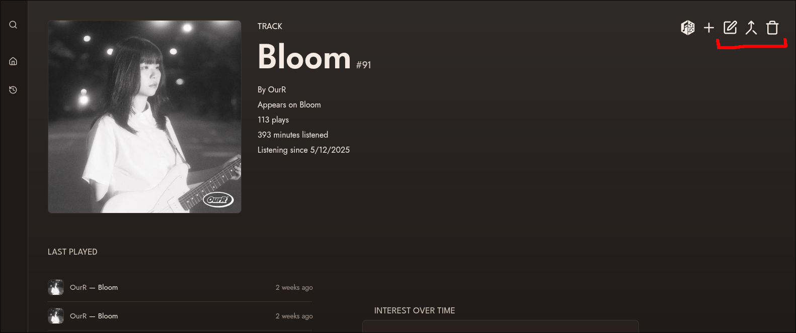
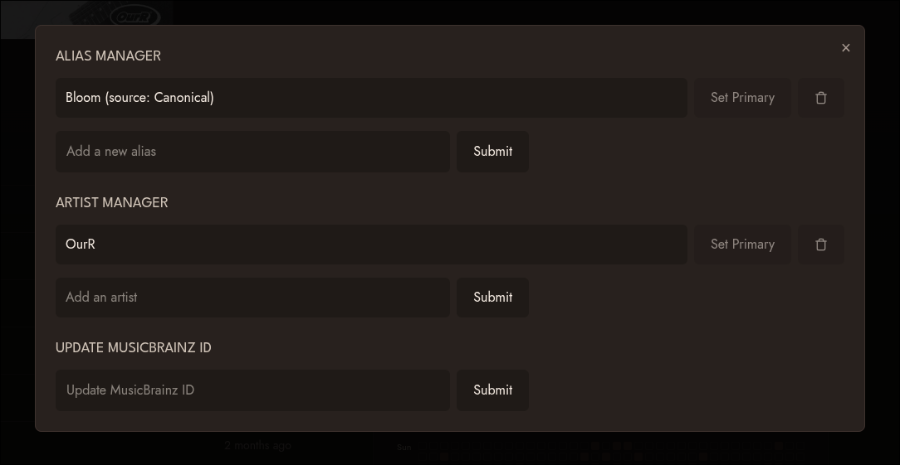

In order to start editing information on your Koito instance, you need to be logged in. See the [Setting up the Scrobber](/guides/scrobbler) guide if you need to log in for the first time.

Once logged in, navigate to the page of the item you want to edit. For this example, we will use the fantastic Korean dream pop group OurR's track [Bloom](https://www.youtube.com/watch?v=USHrBJRmF-o).
When you are logged in and on an artist, album, or track page, you will see the editing options on the top right.

#### Editing

The first option from the left is the edit menu. The edit menu lets you edit things like aliases, artists, and MusicBrainz IDs.

In the alias manager section, we can add and remove aliases, as well as set an alias as "primary" to use it as the display name of the item. Koito uses aliases for not only the UI, but also for matching artists, albums, and tracks submitted to the scrobbler, and for searching. So if you are like me and listen to a lot of music from countries with non-latin script, adding aliases makes it easy to search for those items.

We can also add and remove artist associations, as well as update the MusicBrainz ID of the item. Note that MusicBrainz IDs for items must be unique among other items of the same type (artists, albums, and tracks).

For artists and albums, similar editing options will be shown.

#### Editing Images

The easiest way to replace an image is to simply drag an image file from your computer onto the page of the artist, album, or track you want to change the image for. This only works when you are logged in.

The other way to replace images is using the Replace Image option, which is the second editing option in the list, to provide a URL to the image you want to use.

Note that you can only edit images on an artist or album page, as the image shown for a track is the same as the image of the album it belongs to.

#### Merging Items

Koito allows you to merge two items, which means that all of that item's children (for artists: albums, tracks and listens; for albums: tracks and listens; etc.) will be assigned to a different item, and the old item will be deleted.

For this example, we will use the incredible track [Tsumugu](https://www.youtube.com/watch?v=NDwqZIXOvKw) by the Japanese artist とた (Tota). Here we can see there two versions of the track, one in Japanese and one romanized. I only want to keep the Japanese one. So, just navigate to the page for the Japanese-titled track, open the Merge Items menu (the third editing option), search for the track we want to be merged, and click "Merge Items". A text will appear in the UI to clarify which track is the primary and which will be merged into it.

If we wanted to merge the other way, and only keep the romanized track, just click the "Reverse merge order" checkbox.

If you are ever confused which item will be kept and which will be dissolved, just remember that by default, **the page you are on is the item that will be kept**.

Once merged, we can see that all of the listen activity for Tsumugu has been asigned to 紡ぐ.

You can also search for items when merging by their ID using the format `id:1234`.

:::danger

Merge operations are irreversible. Make sure you have the right items selected before you merge them.

:::

#### Deleting Items

To delete at item, just click the trash icon, which is the fourth and final icon in the editing options. Doing so will open a confirmation dialogue. Once confirmed, the item you delete, as well as all of its children and listen activity, will be removed.

:::danger

Deleting items is irreversible.

:::
